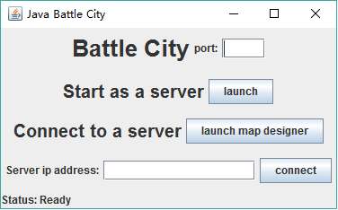
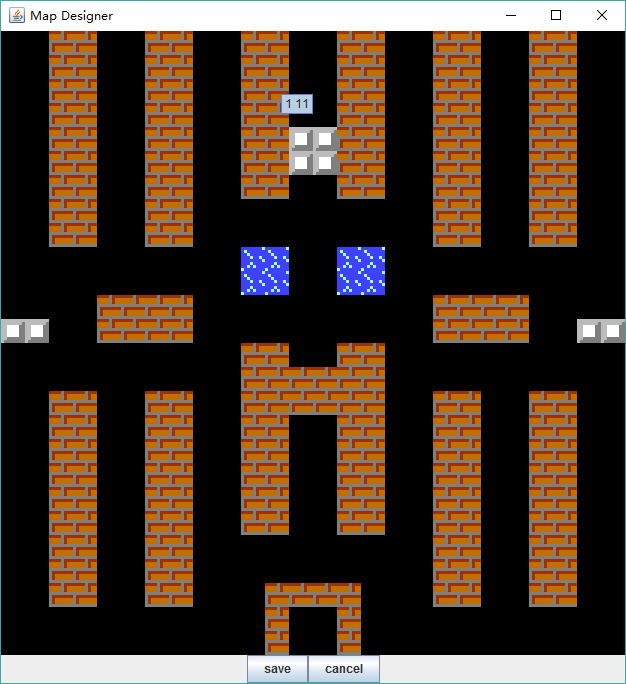
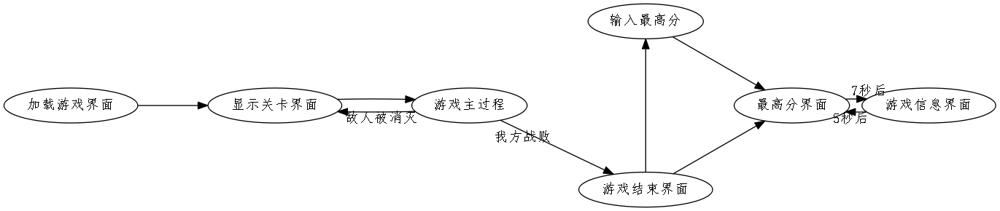
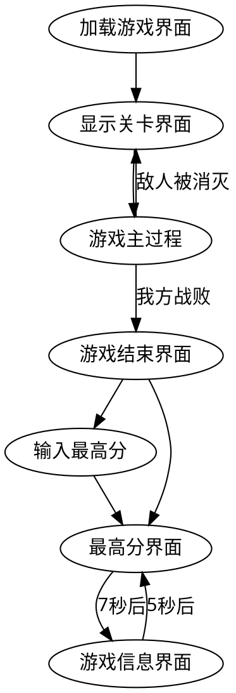
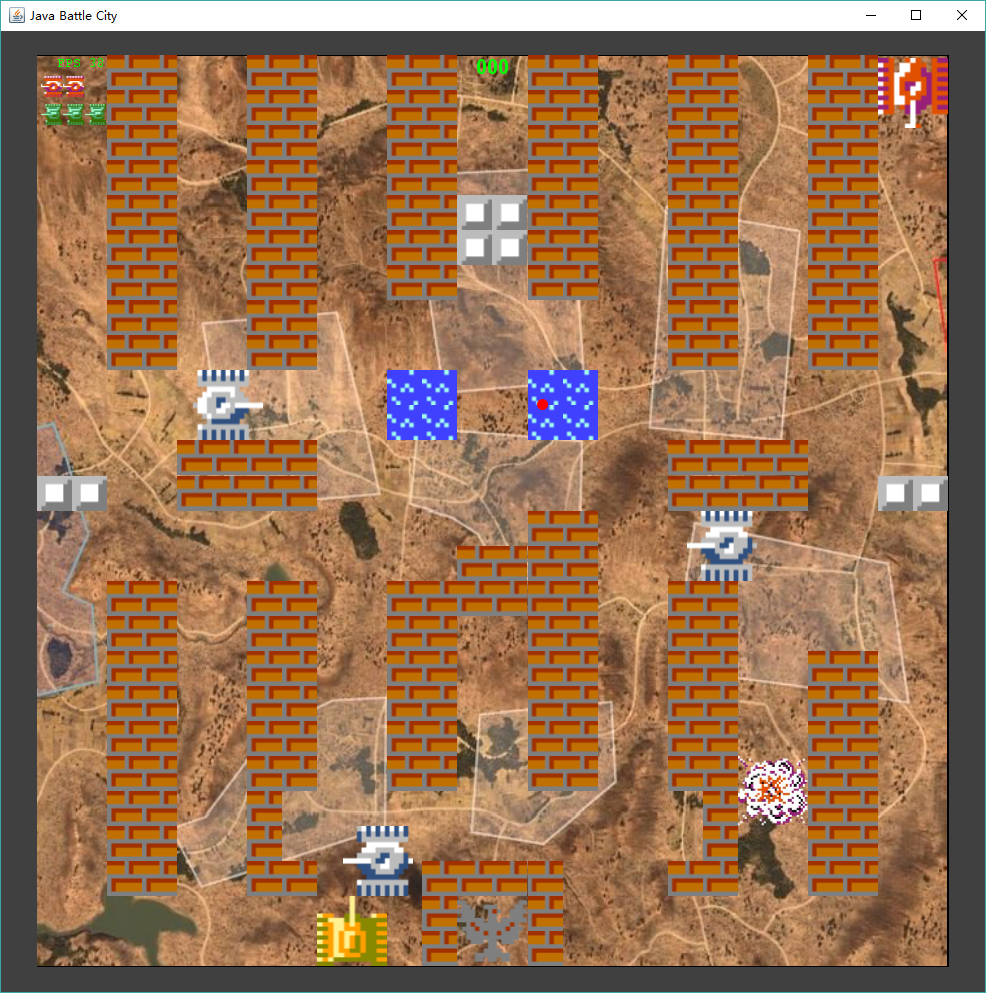

# Java坦克大战实验报告

[TOC]

## 前言

我在这次大作业中实现了一个通过填写IP地址和端口进行对战的坦克大战游戏，并附加了一个地图编辑器。下面我将分模块、分功能的对我的大作业进行说明。

特别需要说明的是我采用了***Fundamental-2D-Game-Programming-With-Java***一书的代码框架，这个游戏框架可以在https://github.com/TimothyWrightSoftware/Fundamental-2D-Game-Programming-With-Java处获得。

**如果不想自己编辑游戏地图，可以将作业文件夹下的`battlemap_server.dat`拷贝至用户文件夹（如`C:\Users\[User Name]`目录下）。**

## 操作说明

### 主菜单

启动程序后会进入如图的**主菜单界面**。

- 点击`launch map designer`，会进入地图编辑器界面。
- - 填写端口

  - 点击`launch`

    本机将作为**服务器**进入等待客户端连接的状态。
- - 填写端口

  - 填写服务器IP地址

  - 点击`connect`

    本机将作为**客户端**和远程的主机联机对战。

### 地图编辑器

进入地图编辑器界面后主菜单会消失，直到退出地图编辑器后再重新显示。

程序将从**系统的用户文件夹**（如`C:\Users\[My User Name]`）下加载`battlemap_server.dat`作为地图文件，如果没有的话就会创建默认的地图文件。

单击地图的位置就可以改变该处的地块类型，光标旁会有文本提示该处的坐标。点击`save`就可以保存地图，点击`cancel`即可退出地图编辑器。

建议不要手动修改`battlemap_server.dat`文件，因为如果地图文件不合法，游戏就会崩溃。

### 游戏主进程

#### 加载游戏界面

系统正在进行预处理并加载多项资源。屏幕上的进度条显示了加载的进度。

#### 显示关卡界面

显示当前的关卡数。

备注：每个关卡都会使用服务器端的`battlemap_server.dat`文件作为地图，并且被破坏的地形会在每关开始时重置。随着关卡的增加，每关出现的地方坦克会增多。

#### 游戏主过程

使用`A`、`S`、`D`、`W`键来控制坦克的移动，使用`Enter`键来发射子弹，按`ESC`键可以暂停游戏。

- 每过$6s$会有一个新的敌方坦克出生。
- 砖墙可以被射穿，子弹可以穿过水面。
- 敌方坦克全部被消灭后进入下一关。
- 我方重生点数耗尽或者基地被攻击后游戏结束。

#### 游戏结束界面

显示`Game Over`字样。

#### 最高分界面

显示历史最高分。

#### 游戏信息界面

显示游戏的版本、制作人（也就是我）和致谢等相关信息。

#### 输入最高分界面

如果分数进入了历史前十，就需要填写自己的名字。

使用`A`,`S`,`D`,`W`移动光标选取字母，使用`Enter`键输入字母，在输入`end`后输入结束，进入最高分界面。

#### 特别说明

我在多处对可能出现的异常做出了处理，其中最重要的一个是：**如果一方在游戏中途关闭了程序，另一方会弹出对话框警告并随即关闭程序**。

#### 状态机

## 实现说明

### 图形绘制

采用了`Canvas`和`BufferStrategy`进行双缓冲的绘制。并将`BufferedImage`封装在`Sprite`中，使得在高层绘图时无需考虑缩放问题。在缩放时使用了抗锯齿，并且在左上角显示了当前的的fps。

建立的真实坐标系到屏幕坐标系之间的坐标变换，使得在处理数据时不需要考虑屏幕坐标系而是考虑**平面直角实数坐标系**，并且使游戏支持按比例缩放。

### 碰撞检测

实现了坦克、墙与子弹之间的碰撞检测，这里特别说明几点：

- 子弹用不同的颜色区分阵营，如果撞上了与其阵营不同的坦克就会造成伤害。
- 子弹可以在空中互相抵消。
- 砖墙可以被射穿，子弹可以穿过水面。
- 坦克只会**沿着格线**行走。

#### 网络状态同步策略

我使用了`TCP`作为连接协议，使用了`lockstep`算法作为同步策略。

程序将**两帧绘制之间**的**所有按键操作**传给远方的机器，在应用了**本地和远程**的按键操作之后（参加`keyboard.poll()`方法）进行游戏状态刷新和图形绘制。

注意到网络的延迟会很大的影响fps，我们选择将最近几帧的操作先**暂存**下来，刷新**数帧前**的状态并且绘制**数帧前**的图像，这样就给网络延迟预留了时间，但是会导致玩家会感觉到自己的操作过了一段时候后才起反应（即使是在本地的机器上）。

这就需要在fps和响应时间之间做一个权衡。这里我选择了延迟5帧。~~注意这里有一个**局限**：**本应测量网络的ping和fps来动态的决定延迟的帧数，但是我这里直接使用了固定的延迟**~~。在新的版本中，我的程序能够动态的调整延迟和睡眠时间，从而尽量减少卡帧的现象，详见`BattleNet`类。

特别说明的是`BlockingQueue`能够在队列为空时让调用`take()`的进程阻塞，非常适合用来进行lockstep的操作。

### 音效和音乐

Java提供的声音API比较底层，所以我直接用了框架中封装好的`QuickRestart`来播放音效。

实现了如下音效：

- 发射炮弹
- 坦克爆炸
- 击穿重型坦克装甲
- 击碎砖块
- 开始音乐
- 胜利音乐
- 失败音乐

## 类和模块的设计

### 游戏框架

这部分主要是采用了书中的框架并对框架进行了一定的修改。

- 实现了二维向量`Vector2f`和二维仿射矩阵`Matrix3x3f`进行游戏中的二维图形运算和坐标变换。
- 用`Sprite`封装了图片并在游戏中进行精灵的绘制。
- 用`KeyboardInput`抽象了键盘的事件处理并使输入和网络同步。
- 在package `sound`中实现了播放音乐的类。

### 游戏状态

整个游戏线程的主循环在`CompleteGame`中实现，其中最重要的组件是`StateController`。

`StateController`负责**记录当前游戏的状态**并**将所有加载好的组件加入到映射中**。只要有`StateController`的实例的引用，在代码的任何部分都可以通过**资源的名字**（用`String`来表示）来调用这些资源。

不同的游戏状态继承了`State`或`AttractState`类型，并重写了其中的

- 进入状态

- 输入处理
- 状态更新
- 图形绘制

函数来实现具体的功能。

#### `GameLoading`

使用`ExecutorService`来并发的加载图片和音频，并进行初始化，在屏幕上可以打印任务的进度。

#### `LevelPlaying`

这是游戏的主过程，里面主要是更新游戏里的组件并进行击杀判定。主要的功能有：

- 处理坦克的输入
- 进行AI的决策
- 更新坦克的状态
- 更新爆炸效果
- 进行击杀判定和处理
- 进行子弹的刷新和碰撞检测
- 检查游戏胜利和失败的条件
- 绘制主游戏界面

还有若干个简单的游戏状态，请查看package `state`里的代码，这里不再赘述。

### 游戏对象

#### `Acme`

最上方的图层，用来绘制HUD、分数、生命等。

#### `HighScoreMgr`

高分管理器，用来从**用户文件夹**中加载最高分并保存最高分。

#### `QuickRestart`

可以播放多次并且播放一次后不会循环播放的音频对象。

#### `Gui_BattleCity`

实现了游戏主菜单界面。

#### `MapDesigner`

实现了地图编辑器界面。

#### `BattleNet`

用`lockstep`算法实现的网络同步策略。

实现了掉线的提示和错误处理。

用`LinkedBlockingQueue`来运行输入信息的生产——消费循环。

#### `Bullet`

子弹对象的实现。

#### `GameMap`

- 实现了地图工厂，加载并处理地图对象。
- 负责与地图文件的文件交互。
- 负责地图的绘制和修改。
- **帮助AI根据地图做出决策**。

##### AI策略

有$90\%$的可能使用`bfs`算法寻找到达玩家坦克的最短路，并向该方向前进。

有$10\%$的概率随机移动。

#### `Tank`

对坦克对象的实现。

#### `TankExplosion`

对坦克爆炸效果的实现。

#### `TankFactory`

坦克工厂，用于加载资源并生成坦克实例对象。

## 附录

- 用户文件夹里会留下`battlecity.dat`、`battlemap_server.dat`、`battlemap_client.dat`文件。如果不想留这些文件可以在游戏运行结束后删掉。
- **如果不想自己编辑游戏地图，可以将作业文件夹下的`battlemap_server.dat`拷贝至用户文件夹。**

### 效果图

#### 游戏主界面

